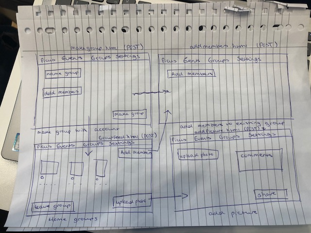
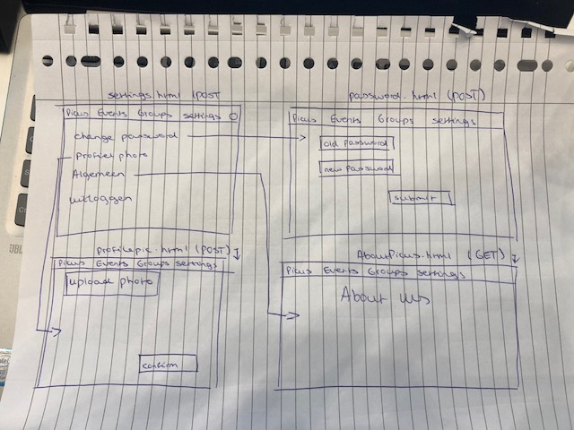

# Technisch Ontwerp
## Controllers
* login.html (POST)
* register.html (POST)
* groups.html (POST)(Homepage)
* makegroup.html (POST (idk))
* groupfeed.html(https://PicUs.com/groups/desbetreffende_groep)(POST)
* settings.html(POST)
* account.html(POST)
* password.html(POST)
* profilepicture.html(POST)
* aboutUs.html(GET)
* makeevent.html(POST)
* index.html(GET)
* event.html(POST/GET)
* eventplus.html(POST)
* addmembers.html(POST)
* search.html(GET/POST)

## Views:

## Models:
* Pop-up bij verkeerde gegevens - Gebruiker wordt teruggestuurd naar de pagina met een melding dat bijvoorbeeld de inloggevens niet kloppen door middel van een pop-up
* Like-functie - Automatische functie die het aantal likes weergeeft onder een foto

## Framework:
* [Bootstrap navigatie bar](https://bootsnipp.com/snippets/Vm7d)
* [Eventueel bootstrap voor het liken van foto’s](https://bootsnipp.com/snippets/featured/modal-lightbox-with-likedislike)

## Eventuele extra links:
* gebruikersnaam.html(POST)
* mijn-fotos.html(POST)
* vrienden.html(POST)